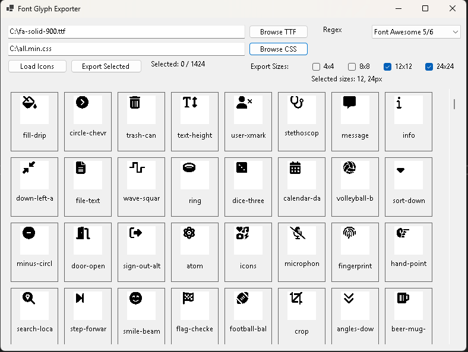

# Font Glyph Exporter

A Windows Forms application for browsing, selecting, and exporting Font Awesome icons (or other icon fonts) as binary files for use in embedded systems, microcontrollers, or other display applications.



## Features

- Browse and preview icons from Font TTF files
- Support for multiple font formats through configurable regex patterns
- Easy icon selection with visual preview
- Export icons in various sizes (4x4, 8x8, 12x12, 24x24)
- Exports as 1-bit monochrome binary format for efficiency
- Output indexed JSON for easy integration with your applications

## Requirements

- .NET 6.0 or later
- Windows OS
- Font TTF file
- Corresponding CSS file with icon mappings

## Getting Started

1. Download the latest release or build from source
2. Run the application
3. Browse to select your TTF font file
4. Browse to select your CSS file with icon mappings
5. Select the appropriate regex pattern for your font or create a custom one
6. Click "Load Icons" to view all available icons
7. Select the icons you want to export
8. Choose desired output sizes using the checkboxes
9. Click "Export Selected" to generate the binary files

## Building from Source

```bash
# Clone the repository
git clone https://github.com/programmingPug/FontGlyphExporter.git

# Navigate to the project directory
cd FontGlyphExporter

# Build the project
dotnet build

# Run the application
dotnet run
```

## How It Works

The application:

1. Loads the TTF font file into a private font collection
2. Parses the CSS file using regex to extract icon names and Unicode values
3. Renders each icon in the UI for preview
4. When exporting, creates a 1-bit monochrome bitmap for each selected icon at each selected size
5. Saves these bitmaps as binary files, where each bit represents a pixel (1 = black, 0 = white)
6. Generates a JSON index file mapping icon names to their file information

## Regex Patterns

The application includes several predefined regex patterns:

- **Font Awesome 5/6**: `.fa-([a-z0-9-]+)\s*{[^}]*--fa:\s*"\\(f[a-f0-9]{3,4})"`
- **Font Awesome 4**: `.fa-([a-z0-9-]+):before\s*{[^}]*content:\s*"\\(f[a-f0-9]{3,4})"`
- **Material Icons**: `.material-icons-([a-z0-9-]+):before\s*{[^}]*content:\s*"\\(e[a-f0-9]{3,4})"`
- **Custom**: Enter your own regex pattern

The regex should capture two groups:
1. The icon name
2. The Unicode hex value

## Output Format

### Binary Files

The binary files are stored in the `output/icons` directory. Each bit represents a pixel:
- 1 = Black pixel (icon)
- 0 = White pixel (background)

Each row is padded to a byte boundary, with bits ordered from least significant to most significant.

### JSON Index

The program generates a JSON index file (`output/icons_index.json`) with metadata for all exported icons:

```json
[
  {
    "name": "calendar",
    "file": "icon_calendar_12x12.bin",
    "width": 12,
    "height": 12
  },
  {
    "name": "calendar",
    "file": "icon_calendar_24x24.bin",
    "width": 24,
    "height": 24
  }
]
```

## Use Cases

- Embedded systems with monochrome displays
- Microcontroller applications
- LCD/OLED screens
- E-paper displays
- Any application requiring lightweight icon representation

## License

This project is licensed under the MIT License - see the LICENSE file for details.

## Acknowledgments

- .NET Windows Forms for the UI framework
